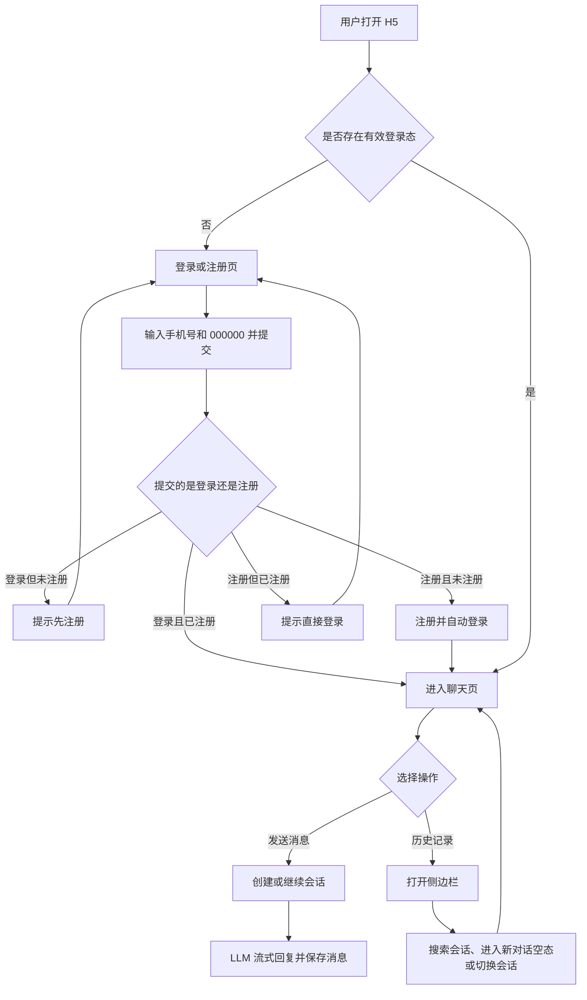

# LittleDuck 基于 LLM 的 H5 Chatbot MVP 产品需求文档

## 0. 文档信息

| 项目 | 内容 |
| --- | --- |
| 产品名称 | LittleDuck |
| 文档类型 | 产品需求文档（PRD） |
| 版本 | V1.7 |
| 状态 | 评审通过 |
| 创建日期 | 2026-07-16 |
| 产品形态 | 用户端 H5 + PC Web 管理端 |
| MVP 核心闭环 | 手机号注册/登录 → 发起多轮对话 → 查看历史会话 → 管理员配置 LLM 并审查聊天及模型调用记录 |

### 0.1 UI 参考稿

本 PRD 以 `/页面UI稿` 目录中的设计稿为视觉基准：

| 页面/状态 | 参考文件 |
| --- | --- |
| 用户注册 | `页面UI稿/注册页.png` |
| 用户登录 | `页面UI稿/登录页.png` |
| 聊天主页面 | `页面UI稿/对话框.png` |
| 输入法唤起状态 | `页面UI稿/对话框-输入状态.png` |
| 历史会话侧边栏 | `页面UI稿/侧边栏.png` |

设计稿尚未覆盖的加载、空态、错误、断网、生成中、停止生成、验证码按钮状态等，以本 PRD 的产品规则为准，进入开发前需补充相应 UI 状态稿。现有 UI 稿仅作为用户端 H5 参考，PC 管理端需另行设计。

### 0.2 版本记录

| 版本 | 日期 | 说明 |
| --- | --- | --- |
| V1.0 | 2026-07-16 | 基于用户需求和现有 UI 稿形成 MVP 初稿 |
| V1.1 | 2026-07-16 | 调整为固定万能验证码、移除短信和性能要求，管理端改为 PC Web 并增加聊天及 LLM 调用记录查询 |
| V1.2 | 2026-07-16 | 删除数据模型、接口、系统架构等技术设计内容，PRD 聚焦产品功能、交互与验收 |
| V1.3 | 2026-07-16 | 进一步缩小 MVP 范围，简化 OpenAI 配置，取消审计、内容安全、隐私合规和数据分析要求，并固化已确认产品决策 |
| V1.4 | 2026-07-16 | 根据独立评审补齐会话创建、异常重试、退出登录和管理端页面状态，统一 Prompt 与历史话题规则 |
| V1.5 | 2026-07-16 | 根据主线功能评审统一会话与话题术语、Prompt 展示口径、多轮上下文规则和 LLM 配置生效范围 |
| V1.6 | 2026-07-16 | 明确登录校验顺序、测试连接配置来源、管理端话题定义和会话标题生成输入范围 |
| V1.7 | 2026-07-16 | PRD 完成主线功能与一致性审核，文档状态更新为评审通过 |

### 0.3 术语说明

| 术语 | 定义 |
| --- | --- |
| 会话 | 用户端的一段独立聊天，包含该段聊天中的用户消息和助手消息 |
| 历史会话 | 当前用户已经创建的会话列表 |
| 话题 | 用户会话在管理端对应的展示记录；一个话题对应一个会话，话题标题与会话标题相同 |
| Prompt | 某次 OpenAI 调用中实际送入模型的指令和消息内容，按实际角色及顺序展示；不是包含模型参数、请求头或网络传输信息的原始 API 请求体 |

---

## 1. 项目背景

LittleDuck 计划建设一个面向外部用户的通用型 AI Chatbot。产品首期以 H5 形式提供用户服务，通过手机号和验证码输入形式完成注册、登录，以 LLM 提供文本问答能力，并保存用户的历史对话。

本期为回避短信服务依赖，不建设真实验证码生成和短信发送能力。注册、登录页面仍保留手机号和 6 位验证码输入形式，系统统一将 `000000` 作为注册、登录的万能验证码。

MVP 的重点不是一次性建设完整的 AI 应用平台，而是尽快验证以下核心链路：

1. 用户是否能以足够低的门槛完成注册和登录。
2. 用户是否能完成连续、多轮的文本对话。
3. 用户是否愿意返回并继续使用历史对话。
4. 管理员是否能自主完成 LLM 配置，并查看聊天和模型调用过程。
5. 产品是否能为后续多模型、多模态、知识库和更多终端保留扩展空间。

---

## 2. 产品目标

### 2.1 MVP 产品目标

- 建立从用户注册、登录、聊天到历史记录访问的完整用户闭环。
- 提供可理解、支持流式输出的 LLM 文本对话体验。
- 保存用户、会话和消息，支持页面刷新和再次登录后恢复。
- 提供 PC Web 管理端，支持 LLM 配置和聊天调用记录审查。
- 为后续增加其他 LLM、图片、文件、知识库和更多服务渠道保留产品扩展空间。

### 2.2 非目标

MVP 不以实现下列目标为前提：

- 不建设完整的模型管理平台或运营平台。
- 不承诺回答内容绝对正确，不将产品定位为医疗、法律、金融等专业决策工具。
- 不支持密码登录、第三方账号登录或游客模式。
- 不支持图片、文件、语音等多模态输入。
- 不支持联网搜索、知识库/RAG、插件或 Agent 工具调用。
- 不支持对话分享、导出、收藏、重命名或删除。
- 不支持用户套餐、计费、充值和模型选择。
- 不支持复杂的管理员权限和用户管理。
- 不做内容安全、品牌语气、拒答边界和垂直场景限制。
- 不做用户消息量、模型用量和预算限制。
- 不支持微信内置浏览器专项适配和微信分享落地。

本期不设置性能指标、容量基线和性能验收要求。

---

## 3. 用户与角色

### 3.1 普通用户

通过手机号完成注册或登录，使用 Chatbot 进行文本对话，并查看自己的历史对话。

权限边界：

- 只能查看和操作本人会话。
- 不能查看 LLM 配置、其他用户或系统运行信息。
- 未登录时不能进入聊天页或查看聊天数据。

### 3.2 管理员

通过独立 PC Web 管理端登录后，配置当前生效的 LLM API 信息，可选择执行连接测试，并按话题查看聊天记录及每次 LLM API 调用的 Prompt 和返回内容。

MVP 初始化管理员账号为 `admin`，密码为 `admin`。本期不在管理端提供新增管理员、角色分配、修改密码和找回密码功能。

---

## 4. 产品范围

### 4.1 P0：MVP 必须实现

#### 用户端

- 手机号 + 固定万能验证码注册。
- 手机号 + 固定万能验证码免密登录。
- 登录态保持和退出登录能力。
- 进入新对话空态，并在首条用户消息发送成功后创建会话。
- 纯文本消息发送。
- LLM 流式回复。
- 多轮上下文对话。
- 回复生成中、停止、失败和重试状态。
- 会话和消息保存。
- 历史会话侧边栏。
- 历史会话按时间分组、切换和标题搜索。
- 首条消息后生成临时标题，并在会话首次成功回复后尝试生成正式标题。
- H5 移动端适配。

#### 管理端

- 独立管理员登录。
- PC Web 页面，不按 H5 移动端布局实现。
- OpenAI API Key 和模型的查看、编辑与保存。
- API Key 在管理端以明文展示。
- 可选的连通性测试，不影响配置保存和生效。
- 按话题查询全部用户聊天记录。
- 按话题查看聊天回复、会话标题生成和重试等每次 LLM API 通信的 Prompt 和 LLM 返回内容。

#### 业务保障

- 固定万能验证码校验，不建设验证码生成和短信发送服务。
- 用户的历史会话、消息和 LLM 调用记录可以持续查看。
- 普通用户只能查看本人聊天，管理员才能查看管理端内容。

### 4.2 明确不进入 MVP

- 会话删除、重命名、置顶和批量管理。
- 用户端不支持复制整条消息、点赞、点踩，以及对成功回复的重新生成；失败或停止后的重试、管理端记录内容复制不受此限制。
- 图片、文件和语音输入。
- 多个 LLM 服务商、多模型配置及切换。
- System Prompt 配置。
- 用户资料和账号注销页面。
- 管理端用户管理和用量看板。
- 模型用量、成本和配额控制。
- 知识库/RAG、联网搜索、工具调用。
- 原生 iOS/Android App 和小程序。
- 群聊、人工客服转接。
- 社区、公开对话广场。
- 复杂工作流和自主 Agent。
- 商业化支付体系。

> UI 稿中的“+”或图片图标属于后续多模态入口，本期直接隐藏。

---

## 5. 关键产品假设

为保证产品范围明确，本版本暂按以下假设锁定：

1. 首期仅面向中国大陆手机号，国家码固定为 `+86`。
2. 用户必须注册并登录后才能聊天，不提供游客试用。
3. Chatbot 为通用文本助手，不限定垂直行业、品牌语气和拒答边界。
4. 首期使用 OpenAI 服务，只允许一个生效中的 LLM 配置，具体模型由管理员配置。
5. 会话标题由系统自动生成；标题生成失败时使用首条用户消息截断作为兜底。
6. 搜索范围仅包括会话标题，不搜索消息全文。
7. 会话、Prompt 和 LLM 返回内容默认长期保留。
8. 本期不限制单用户消息量、模型用量和模型预算。
9. 本期不接入真实手机验证码，后续版本再移除万能验证码。

---

## 6. 信息架构与访问规则

| 端 | 页面 | 访问条件 |
| --- | --- | --- |
| 用户端 | 注册页 | 未登录 |
| 用户端 | 登录页 | 未登录 |
| 用户端 | 聊天页 | 已登录 |
| 用户端 | 历史会话侧边栏 | 已登录 |
| 管理端 | 管理员登录 | 未登录管理员 |
| 管理端 | LLM 配置 | 已登录管理员 |
| 管理端 | 聊天话题列表 | 已登录管理员 |
| 管理端 | 聊天与 LLM 调用详情 | 已登录管理员 |

访问规则：

- 未登录用户进入聊天页时跳转至登录页。
- 已登录用户进入登录页或注册页时跳转至聊天页。
- 普通用户登录态与管理员登录态相互隔离。
- 用户登录失效时提示重新登录，并跳转至登录页。
- 登录成功后默认进入最近有消息的会话；无历史会话时进入“新对话”空态。

---

## 7. 核心用户流程

### 7.1 注册流程

1. 用户进入注册页。
2. 输入中国大陆手机号。
3. 用户可点击“获取验证码”，按钮文案变为“验证码已获取”；系统不生成验证码，也不发送短信。
4. 是否点击“获取验证码”不作为注册的前置条件。
5. 用户在验证码输入框输入固定验证码 `000000`，点击“注册”。
6. 系统校验验证码是否等于 `000000`，并校验手机号是否已注册。
7. 注册成功后自动建立用户登录态并进入聊天页。
8. 若手机号已注册，提示“该手机号已注册，请直接登录”，并提供跳转入口。

### 7.2 登录流程

1. 用户输入手机号。
2. 用户可点击“获取验证码”，按钮文案变为“验证码已获取”；是否点击不作为登录的前置条件。
3. 在验证码输入框输入固定验证码 `000000`。
4. 点击“登录”。
5. 系统同时校验验证码和手机号注册状态。
6. 验证码正确且手机号已注册时，建立登录态并进入聊天页。
7. 若手机号未注册，不建立登录态，提示“该手机号尚未注册，请先注册”，并提供跳转入口。

### 7.3 首次对话流程

1. 新用户进入聊天页，显示静态欢迎语和输入框。
2. 用户输入文本并发送。
3. 用户消息发送成功后创建会话，并立即出现在历史侧边栏顶部。
4. 会话先使用首条用户消息前 20 个字符作为临时标题。
5. 系统调用 LLM，页面逐字展示流式回复。
6. 本会话首个助手回复成功完成后，系统使用首条用户消息和该助手回复尝试生成正式标题。
7. 回复失败、被停止或标题生成失败时，继续使用临时标题；后续重试或新回复成功后可再次尝试生成。

### 7.4 继续历史对话流程

1. 用户点击聊天页右上角历史图标。
2. 左侧抽屉展示历史会话。
3. 用户选择某个会话。
4. 抽屉关闭，聊天页加载该会话的历史消息。
5. 用户发送新消息，系统基于该会话上下文继续回复。
6. 当前会话移动到历史列表顶部，并按最新活动时间重新分组。

---

## 8. 用户端详细需求

### 8.1 注册页

#### 8.1.1 页面元素

| 元素 | 要求 |
| --- | --- |
| 品牌区 | 展示 LittleDuck Logo 和名称 |
| 手机号标签 | 文案“手机号” |
| 国家码 | MVP 固定展示 `+86`，不可编辑 |
| 手机号输入框 | 数字键盘，最多输入 11 位数字 |
| 获取验证码按钮 | 手机号格式合法后可点击；点击后文案变为“验证码已获取”，不生成验证码、不发送短信 |
| 验证码输入框 | 数字键盘，最多输入 6 位数字 |
| 注册按钮 | 手机号和验证码均合法时可点击 |
| 登录入口 | “已有账号？去登录” |

#### 8.1.2 交互与校验

- 手机号为空时不显示错误；失焦或提交时校验。
- 手机号格式规则：首期按中国大陆 11 位手机号校验。
- 点击“获取验证码”后文案变为“验证码已获取”，不显示倒计时；该操作不是注册或登录的前置条件。
- 本期注册和登录只接受 6 位固定验证码 `000000`，不区分注册和登录场景，不设置有效期。
- 页面不主动展示万能验证码；由项目方将 `000000` 提供给本期实际使用人员。
- 输入其他验证码时，统一提示“验证码错误，请重新输入”。
- 点击注册后按钮进入加载态并防止重复提交。
- 注册成功后自动登录，不要求用户再次输入验证码。

#### 8.1.3 页面状态

- 默认态。
- 手机号格式错误。
- 获取验证码按钮操作状态。
- 验证码错误。
- 注册提交中。
- 手机号已注册。
- 网络错误。
- 注册成功。

### 8.2 登录页

#### 8.2.1 页面元素

遵循登录 UI 稿，包含：

- Logo、欢迎语和 LittleDuck 名称。
- 手机号输入框。
- 6 位验证码输入框。
- 获取验证码按钮。
- 登录按钮。
- “没有账号？去注册”入口。

#### 8.2.2 业务规则

- 手机号和固定验证码校验规则与注册页一致。
- 本期登录只接受 `000000`，不生成、不发送真实验证码。
- 验证成功但手机号未注册时，不自动静默注册；明确提示并引导至注册页。
- 用户登录状态默认有效期为 7 天。
- 用户主动退出后，当前登录状态立即失效。
- 同一账号多设备登录在 MVP 中允许，不互相踢下线。

#### 8.2.3 页面状态

- 默认态。
- 手机号格式错误。
- 验证码错误。
- 手机号未注册。
- 登录提交中。
- 登录态失效。
- 网络错误。
- 登录成功。

### 8.3 聊天页

#### 8.3.1 页面结构

| 区域 | 要求 |
| --- | --- |
| 顶部导航 | 左侧 Logo、中间 LittleDuck、右侧历史会话图标；吸顶展示 |
| 消息区 | 可纵向滚动，展示用户消息和助手消息 |
| 用户消息 | 右侧绿色气泡 |
| 助手消息 | 左侧 Logo + 白色气泡 |
| 输入区 | 底部固定，文本输入框 + 发送按钮 |
| 安全区 | 兼容 iPhone 底部安全区和软键盘 |

#### 8.3.2 新对话空态

- 新对话空态在用户发送首条消息前不创建会话，也不出现在历史会话中。
- 页面可展示静态欢迎语：“你好！有什么可以帮助你？”
- 欢迎语不是历史消息，不参与 LLM 上下文，也不出现在历史会话中。
- 输入框占位文案为“输入消息……”。

#### 8.3.3 输入规则

- MVP 只支持纯文本。
- 去除消息首尾空白后，空消息不可发送。
- 单条用户消息最大 4,000 个字符，超过时显示剩余可输入字符数并禁止发送。
- 输入框随内容自动增高，建议最少 1 行、最多 5 行；超过后输入框内部滚动。
- 唤起软键盘时，输入区始终位于键盘上方，消息区自动缩短，不得被键盘遮挡。
- 用户点击发送后立即在消息区展示自己的消息，减少等待感。
- 当前 H5 页面同一时刻只允许存在一个生成中的助手回复。
- 弱网或重复点击时不得产生重复的用户消息。

#### 8.3.4 消息发送与流式回复

正常链路：

1. 用户输入文本并点击发送。
2. 页面立即展示用户消息。
3. 用户消息发送成功后，首条消息场景创建新会话并显示临时标题。
4. 系统结合当前会话上下文向 LLM 发起请求。
5. 页面以流式方式逐步展示助手回复，并显示生成中状态。
6. 回复完成后结束生成状态并保存完整对话。

上下文规则：

- 上下文只允许读取当前用户的当前会话。
- 每次聊天请求必须包含当前用户消息。
- 在模型支持的上下文范围内，按原始时间顺序尽可能携带当前会话最近的完整用户—助手对话轮次。
- 当上下文超过模型支持范围时，从最早的完整对话轮次开始移除，优先保留距离当前消息最近的轮次。
- 本期不设置垂直场景、品牌语气、拒答边界或其他特殊 System Prompt 限制。
- MVP 不生成历史摘要；可在后续版本增加“摘要 + 最近消息”的上下文策略。

#### 8.3.5 回复展示

- 支持基础 Markdown：段落、标题、列表、加粗、引用、链接、行内代码和代码块。
- 代码块应保持换行并使用等宽字体展示。
- 超长单词和 URL 必须换行，不得撑破页面。
- 页面刷新或再次进入会话后，展示已保存的最终消息内容。

#### 8.3.6 生成中与停止生成

- 生成中时发送按钮切换为“停止”状态，输入框可保留内容但不能再次提交。
- 用户点击停止后，系统停止继续生成回复。
- 已生成的部分内容保留，助手消息状态标记为“已停止”。
- 已停止的助手消息在其后尚无新用户消息时提供“重试”入口。
- 停止后用户可以重试原消息，也可以继续发送下一条消息；发送新消息后，不再允许重试之前已停止的回复。
- 用户关闭页面或网络中断时，不直接将回复判定为失败；用户再次进入会话后，以系统保存的最终状态为准。

#### 8.3.7 失败与重试

失败类型至少包括：

- 用户网络异常。
- 系统服务不可用。
- LLM API Key 无效。
- LLM 限流或额度不足。
- LLM 请求超时。
- 返回内容解析失败。

展示规则：

- 不向普通用户暴露 API Key 或模型服务的内部错误详情。
- 助手消息区域显示易理解的失败提示，如“回复生成失败，请稍后重试”。
- 失败消息提供“重试”按钮。
- 用户消息未发送成功时，在原消息位置标记“发送失败”，用户可以重新发送。
- 未发送成功的用户消息只保留在当前页面；刷新、关闭页面或切换会话后不再保留。
- 用户消息已发送成功但 LLM 回复失败时，保留用户消息，并展示失败的助手消息。
- 失败的助手消息在其后尚无新用户消息时提供“重试”入口；发送新消息后，不再允许重试之前失败的回复。
- 重试复用原用户消息，不重复插入用户消息；原失败或已停止的助手消息保留，新回复展示在其后。
- 重试时，失败或已停止的助手内容不作为已有助手回复参与后续上下文。
- API Key 无效、额度不足等系统性问题需记录在对应的 LLM 调用详情中，管理员查看时可见。

#### 8.3.8 滚动规则

- 首次进入历史会话时定位到最新消息。
- 用户位于消息底部时，流式内容自动跟随滚动。
- 用户主动向上查看历史后，停止强制滚动，并显示“回到底部”按钮。
- 切换会话时清理上一会话的临时流式 UI 状态。
- 首次进入会话时展示最近 30 条消息，向上滚动时继续加载更早消息。

### 8.4 历史会话侧边栏

#### 8.4.1 打开与关闭

- 点击聊天页右上角历史图标，从左侧滑出抽屉。
- 抽屉宽度建议为屏幕宽度的 75%～82%，右侧显示半透明遮罩。
- 点击关闭图标、遮罩区域或执行系统返回操作时关闭抽屉。
- 打开抽屉后，底层聊天页面不可滚动和点击。
- 回复生成中允许打开侧边栏并查看、搜索历史会话，但不允许切换会话或进入新对话空态；用户需等待回复完成或先停止生成。

#### 8.4.2 页面元素

| 元素 | 要求 |
| --- | --- |
| 标题区 | Logo、“聊天记录”、关闭按钮 |
| 新对话按钮 | 进入未保存的新对话空态并关闭抽屉 |
| 搜索框 | 按会话标题搜索 |
| 时间分组 | 今天、昨天、最近 7 天、更早 |
| 会话项 | 会话图标 + 标题 |
| 当前会话 | 使用背景色或其他方式高亮 |
| 退出登录 | 固定在侧边栏底部 |

#### 8.4.3 会话列表规则

- 按最近消息时间倒序排列。
- 时间分组按 Asia/Shanghai 时区计算。
- “最近 7 天”不包含今天和昨天。
- 7 天之前统一进入“更早”。
- 只展示至少包含一条用户消息的会话。
- 标题最多展示一行，超出使用省略号，完整标题可通过无障碍标签读取。
- 首条用户消息发送成功后，会话立即出现在列表顶部。
- 每次成功发送新消息后，当前会话移动至列表顶部。
- 最近活动时间以最新一条用户消息或助手消息的产生时间为准，失败或已停止的助手消息也计入。
- 历史会话较多时分批加载，滑动到底部自动加载更多。
- 加载失败时保留已加载内容，并提供重试入口。

#### 8.4.4 新对话

- 点击“新对话”后关闭侧边栏，进入未保存的新对话空态；此时不创建会话。
- 回复生成中点击“新对话”时不执行切换，并提示“请等待回复完成或先停止生成”。
- 若当前已是未发送消息的新对话空态，则保持当前页面，不执行额外操作。
- 首条用户消息发送成功后才正式创建会话，并将其加入历史会话列表。

#### 8.4.5 会话标题

- 首条用户消息发送成功后，截取其前 20 个字符并去除换行，作为临时标题。
- 会话中首个助手回复成功完成后，使用首条用户消息和该助手回复作为标题生成输入，自动尝试生成正式标题。
- 正式标题去除首尾空格和换行，不使用引号、句号；超过 20 个字符时截断至 20 个字符。
- 标题生成结果为空或无法使用时，视为标题生成失败。
- 助手回复失败、被停止，或标题生成失败、超时时，继续使用临时标题。
- 后续重试或新回复产生本会话首个成功完成的助手回复，且会话仍在使用临时标题时，使用首条用户消息和该助手回复尝试生成正式标题。
- 已存在首个成功完成的助手回复但标题生成失败时，后续再次尝试仍使用首条用户消息和该首个成功完成的助手回复，不改用更晚的消息。
- 标题生成不阻塞聊天回复。
- MVP 不允许用户手动修改标题。

#### 8.4.6 搜索

- 搜索范围仅限当前用户的会话标题。
- 用户输入关键词后自动搜索，忽略首尾空格。
- 支持中文、英文和数字的包含匹配。
- 搜索结果仍按最近活动时间倒序排列，不再显示时间分组。
- 搜索为空时恢复分组列表。
- 无结果时展示“未找到相关对话”。

#### 8.4.7 退出登录

- 用户点击侧边栏底部“退出登录”后直接退出，不增加二次确认。
- 退出成功后跳转至登录页。
- 若当前正在生成回复，退出登录视为停止生成，保留已生成的部分内容。
- 退出后通过浏览器返回不能继续查看聊天内容。

---

## 9. 管理端详细需求

管理端为独立的 PC Web 页面，主要面向桌面浏览器使用，不复用用户端 H5 的移动端布局。页面建议采用左侧导航 + 右侧内容区结构，首期包含“LLM 配置”和“聊天记录”两个菜单。

### 9.1 管理员登录

管理端必须独立登录，普通用户不能访问配置和聊天审查功能。

MVP 规则：

- 初始化管理员账号为 `admin`，密码为 `admin`。
- 登录失败提示不区分账号不存在或密码错误。
- 管理端登录状态与用户端登录状态相互隔离。
- 本期不提供管理员账号新增、修改密码和找回密码能力。
- 本期不要求管理员操作审计。
- 登录页包含管理员账号、密码输入框和登录按钮。
- 页面需覆盖默认、登录中、账号或密码错误、网络错误和登录成功状态。
- 管理端左侧导航底部提供“退出登录”；点击后直接退出并返回管理员登录页。

### 9.2 LLM 配置页

#### 9.2.1 页面定位

用于维护当前 Chatbot 使用的 LLM 调用配置。该页面与“聊天记录”页面共同构成本期 PC 管理端。

#### 9.2.2 配置项

| 配置项 | 必填 | 规则 |
| --- | --- | --- |
| LLM 服务商 | 是 | 固定为 OpenAI，不可编辑 |
| API Key | 是 | 明文展示，可直接编辑 |
| 模型 | 是 | 填写需要使用的 OpenAI 模型 |

温度、最大输出长度、System Prompt 等高级参数不在 MVP 页面开放。

#### 9.2.3 API Key 展示

- 管理员进入配置页后可以查看完整 API Key 明文。
- 管理员可以直接修改 API Key。
- 本期不做 API Key 脱敏展示。

#### 9.2.4 测试连接

- 管理员填写配置后可点击“测试连接”。
- 测试连接使用页面当前填写的 API Key 和模型，包括尚未保存的修改内容。
- 测试请求不携带任何用户对话数据，只发送最小测试内容。
- 页面返回测试成功或失败；失败时可直接展示模型服务返回的错误信息。
- 测试可能产生少量模型费用，按钮旁应有提示。
- 测试连接不会自动保存页面配置，也不会改变当前已保存并生效的配置。
- 测试连接为可选操作，不影响保存。

#### 9.2.5 保存与生效

- 管理员填写 API Key 和模型后，可直接点击“保存”。
- 保存不依赖测试连接结果；未测试或测试失败的配置也允许保存。
- 保存成功后，新配置立即用于后续所有用户业务相关的 OpenAI 调用，包括聊天回复、会话标题生成和重试。
- 本期不提供草稿、版本管理、回退和审计记录。

#### 9.2.6 配置异常

当生效配置不可用时：

- 用户端显示统一提示“服务暂时不可用，请稍后再试”。
- 历史会话和已有消息仍可正常访问。
- 管理员修改 API Key 或模型并重新保存后，后续所有用户业务相关的 OpenAI 调用使用新配置。
- 本期接受因配置错误导致用户端聊天功能不可用，不提供自动回退或其他容错能力。

#### 9.2.7 页面状态

- 首次未配置：展示空表单，引导管理员填写 API Key 和模型。
- 编辑中：管理员可修改 API Key 和模型。
- 测试中、测试成功、测试失败。
- 保存中、保存成功、保存失败。
- 保存失败时保留管理员已填写的内容，允许再次保存。

### 9.3 聊天记录

#### 9.3.1 页面定位

管理员可在话题列表中查看全部用户会话、对话消息，以及每个话题处理过程中每一次与 LLM API 通信的 Prompt 和返回内容，用于产品验证、问题排查和模型效果检查。

该能力只允许已登录管理员访问。

#### 9.3.2 话题列表

话题列表采用适合 PC 的表格布局，默认按最近消息时间倒序排列。

| 展示项 | 说明 |
| --- | --- |
| 话题标题 | 会话标题，点击进入详情 |
| 用户手机号 | 展示完整注册手机号 |
| 消息数量 | 该话题下用户和助手消息总数 |
| LLM 调用次数 | 聊天回复、标题生成和重试等调用总数 |
| 创建时间 | 会话创建时间 |
| 最近消息时间 | 最近一次消息时间 |

查询能力：

- 支持按话题标题关键词搜索。
- 支持按用户手机号精确搜索。
- 支持按创建日期或最近消息日期筛选。
- 支持分页，默认每页 20 条。
- 本期只读，不提供管理员修改、删除用户会话的能力。
- 页面时间统一按 Asia/Shanghai 时区展示；日期筛选包含所选开始日和结束日。
- 页面需覆盖加载中、无话题、无搜索结果和加载失败状态。

#### 9.3.3 话题详情

详情页顶部展示话题标题、用户手机号、创建时间和最近消息时间。

页面主体包含两个页签：

1. **聊天记录**：按时间正序展示该话题内的全部用户消息、助手消息、消息状态和发送时间。
2. **LLM 调用详情**：按调用时间正序展示该话题中每一次 LLM API 通信。

聊天记录规则：

- 明确区分用户消息和助手消息。
- 失败和停止的消息应展示对应状态。
- 重试产生的多个助手回复需分别展示，不覆盖原失败记录。
- 长文本和代码块应支持折叠/展开和复制。
- 页面需覆盖加载中、无聊天记录和加载失败状态。

#### 9.3.4 LLM 调用详情

每次 LLM API 调用作为一个独立步骤展示，至少包括：

| 展示项 | 说明 |
| --- | --- |
| 调用步骤 | 当前话题下全部 LLM 调用按发起时间排列的序号 |
| 调用类型 | 聊天回复、会话标题生成、重试等 |
| 关联内容 | 按调用类型展示实际关联的话题或消息 |
| 调用时间 | 发起调用的时间 |
| 服务商 / 模型 | 实际使用的 LLM 服务商和模型 |
| Prompt | 该次调用实际送入模型的指令和消息内容，保留实际角色及顺序 |
| LLM 返回内容 | 该次调用实际收到的返回内容；成功时为完整内容，失败或停止时可为部分内容或空 |
| 调用状态 | 进行中、成功、失败、已停止 |
| 错误信息 | 失败时展示模型服务返回的错误信息 |

记录规则：

- 聊天回复、会话标题生成和消息重试产生的 LLM 调用都必须记录。
- 每条记录展示该次调用实际送入模型的指令和消息内容，不要求所有调用具有相同的 Prompt 结构。
- Prompt 不等同于原始 API 请求体，不要求展示模型参数、请求头、网络信息或其他传输层内容；服务商和模型通过独立字段展示。
- 聊天回复展示该次实际使用的指令、历史消息和当前消息，并保留实际角色及顺序；标题生成展示其实际标题生成指令、首条用户消息和本会话首个成功完成的助手回复；重试展示其实际重试输入。
- 如果某次调用没有 System Prompt、历史消息或关联助手消息，则不补充不存在的内容。
- 返回内容按实际收到的内容展示。
- 流式调用在生成过程中可显示“进行中”，完成后保存最终聚合内容。
- 调用失败时仍需保存已组装的 Prompt、已收到的部分返回内容和错误信息。
- 每次重试都创建新的调用记录，不覆盖上一条调用记录。
- 测试连接不属于用户话题调用，不显示在聊天记录或话题调用详情中。
- 本期只允许查看和复制，不提供在管理端重新发起用户对话或修改 Prompt 的能力。
- 页面需覆盖加载中、无调用记录和加载失败状态。

#### 9.3.5 数据与权限

- 普通用户无权访问管理端聊天记录。
- 已登录管理员可以查看话题、完整手机号、聊天正文、Prompt、LLM 返回内容和其他页面信息。
- 本期不记录管理员的查看和操作行为。

---

## 10. 非功能需求

### 10.1 安全与权限

- 普通用户只能查看和操作自己的会话，不能查看其他用户的聊天内容。
- 管理端仅允许已登录管理员访问。
- 本期固定万能验证码 `000000` 可用于任意手机号注册、登录，不具备真实手机号所有权验证能力；项目方明确接受该临时风险。
- 本期管理员使用固定账号密码 `admin/admin`，不设置 VPN、IP 白名单或内网访问要求。
- 本期不做管理员操作审计。

### 10.2 可用性与容错

- LLM 服务异常时，历史会话浏览仍应可用。
- LLM 回复失败时，用户应看到易理解的提示和重试入口。
- 弱网、断网或重复点击时，不得产生重复的用户消息。
- 已成功完成的会话和消息在刷新页面或再次登录后仍可查看。
- LLM 配置异常时，管理员可以修改配置并重新保存。
- LLM 调用记录必须真实反映实际调用过程，不得展示伪造或不存在的 Prompt 和返回内容。

### 10.3 兼容性

用户端 H5：

- 以 375 px～430 px 宽的主流手机屏幕为重点适配范围。
- 支持主流 iOS Safari 和 Android Chrome。
- 本期不要求支持微信内置浏览器和微信分享落地。
- 处理刘海屏、底部安全区、软键盘顶起和横竖屏切换。
- 按钮可点击区域建议不小于 44 × 44 CSS px。
- 页面字体随系统设置合理缩放，不因放大导致主要操作不可用。

PC 管理端：

- 面向桌面浏览器设计，建议内容区按 1280 px 及以上宽度布局。
- 支持主流桌面版 Chrome 和 Edge。
- 话题列表、聊天记录和 Prompt/返回内容应支持长文本、代码块和结构化内容的滚动、折叠及复制。
- 本期不要求适配手机端管理页面。

---

## 11. 验收标准

### 11.1 注册与登录

- 输入不合法手机号时不能提交注册或登录，并显示正确提示。
- 点击“获取验证码”只更新页面按钮状态，用户不会收到短信。
- 未点击“获取验证码”时，仍可使用 `000000` 提交注册或登录。
- 注册和登录输入 `000000` 时通过验证码校验。
- 输入除 `000000` 以外的验证码时不能注册或登录，并提示验证码错误。
- 系统不生成、不发送真实验证码。
- 新手机号完成注册后自动进入聊天页。
- 已注册手机号不能重复注册。
- 未注册手机号不能通过登录页面静默创建账号。
- 只有验证码正确且手机号已注册时才建立登录态并进入聊天页。
- 刷新页面后，有效登录态能够恢复。
- 登录态自登录成功起默认保持 7 天；有效期内再次进入无需重新登录。
- 同一用户可以在多台设备同时登录，新的登录不会使其他设备退出。
- 退出登录后不能通过浏览器返回继续访问聊天数据。
- 回复生成中退出登录时，该回复停止生成并保留已生成的部分内容。
- 验证码、完整手机号和敏感登录信息不得出现在用户可见错误中。

### 11.2 聊天

- 首条用户消息发送成功后创建会话；发送失败时不创建历史会话。
- 用户消息先显示并保存，助手回复以流式方式展示。
- 同一会话内连续提问时，每次请求包含当前用户消息，并在模型支持范围内按原始顺序包含最近的完整用户—助手对话轮次；超出范围时从最早轮次开始移除。
- 回复完成后刷新页面，用户和助手消息仍完整存在。
- 空消息和超过 4,000 字符的消息不能发送。
- 回复生成中，当前 H5 页面不能再次提交新消息。
- 点击停止后不再继续追加内容，已生成的部分内容予以保留。
- 最新失败或已停止的助手消息可以重试；发送后续新消息后，旧消息不再允许重试。
- LLM 超时或失败时显示可理解的错误和重试入口。
- 重试不会产生重复用户消息，原失败或已停止的助手消息保留，新回复追加在其后。
- 重试请求不把原失败或已停止的助手内容作为已有助手回复传给 LLM。
- 用户消息发送失败后可重新发送，且不会因重复点击产生重复的已保存消息。
- 未发送成功的用户消息在刷新、关闭页面或切换会话后不再展示。
- 页面或网络中断后再次进入会话时，以系统最终保存状态展示，不重复生成同一条回复。
- Markdown 和代码块正确展示。
- 任一用户都不能查看其他用户的聊天记录。

### 11.3 历史会话

- 未保存的新对话空态不出现在历史会话列表。
- 点击“新对话”只进入未保存的新对话空态，不创建会话；首条用户消息发送成功后才创建会话。
- 首条用户消息发送成功后，会话立即以临时标题出现在列表顶部，无需等待助手回复完成。
- 会话中首个助手回复成功后尝试生成正式标题；回复失败、停止或标题生成失败时继续使用临时标题。
- 正式标题使用首条用户消息和本会话首个成功完成的助手回复生成；标题生成失败后的再次尝试仍使用这两项内容。
- 正式标题为空或超过 20 个字符等情况按标题规则处理，不影响会话查看。
- 历史会话按 Asia/Shanghai 时区划分为今天、昨天、最近 7 天、更早。
- 搜索能够按标题返回当前用户的匹配会话。
- 切换会话后消息内容正确，不混入其他会话内容。
- 当前会话有明确选中态。
- 失败或已停止的助手消息计入最近活动时间，并影响会话排序和时间分组。
- 会话列表分批加载正常；进入会话先展示最近 30 条消息，并可继续加载更早消息。

### 11.4 管理端

- 使用 `admin/admin` 能够登录 PC 管理端。
- 未登录管理员无法访问配置、聊天记录和 LLM 调用详情。
- 普通用户不能进入管理端或查看管理端数据。
- 管理员登录页覆盖登录中、账号或密码错误、网络错误等状态。
- 管理员退出登录后返回管理员登录页，不能继续访问管理页面。
- 管理端按 PC 页面布局实现，在桌面浏览器中可正常使用；不要求 H5 移动端适配。
- 管理员可以查看和编辑完整的 API Key 明文。
- API Key 或模型为空时不能保存；填写非空但不可用的配置时仍允许保存。
- 测试连接为可选操作，不影响保存。
- 测试连接使用页面当前填写的 API Key 和模型；测试不会自动保存配置，也不会改变当前生效配置。
- 未测试或测试失败的配置也可以保存，并立即用于后续所有用户业务相关的 OpenAI 调用，包括聊天回复、会话标题生成和重试。
- 配置页覆盖首次未配置、编辑、测试、保存成功和保存失败状态；保存失败时保留已填写内容。
- 配置错误导致用户端聊天不可用时，管理员可以修改配置并重新保存。
- 管理员可以按话题标题、手机号和日期查询会话。
- 话题列表时间按 Asia/Shanghai 时区展示，日期筛选包含所选开始日和结束日。
- 话题列表和详情页可以展示用户完整手机号。
- 话题详情可以按时间顺序展示完整用户和助手消息。
- 每次聊天回复、标题生成和重试对应的 LLM API 调用均有独立记录。
- 每条调用记录可查看实际送入模型的指令和消息内容，保留实际角色及顺序，不补充该次调用中不存在的 System Prompt、历史消息或其他内容。
- Prompt 不要求展示模型参数、请求头、网络信息等原始 API 请求体内容；聊天回复、标题生成和重试分别展示各自实际使用的模型输入。
- 流式回复在调用完成后展示聚合后的完整返回内容；失败或停止时展示已收到的部分内容，未收到内容时允许为空。
- 测试连接不计入用户话题的 LLM 调用记录。
- 话题列表、聊天详情和 LLM 调用详情均覆盖加载、空态和加载失败状态。
- 管理员查看和操作管理端信息时，不要求生成审计记录。

### 11.5 H5 体验

- 在目标手机浏览器中页面无横向滚动。
- 软键盘弹起时输入框和发送按钮可见、可点击。
- 侧边栏打开后底层页面不可操作，关闭方式均有效。
- 回复生成中可以打开和搜索侧边栏，但不能切换会话或进入新对话空态；停止或完成生成后恢复操作。
- 网络慢、断网和恢复网络时页面不会白屏或丢失已成功保存的消息。
- 页面加载失败和列表为空时均有明确状态。

---

## 12. 上线依赖与发布检查

### 12.1 外部依赖

- 可用的 OpenAI API Key 和模型权限。
- 用户端 H5 和 PC 管理端的正式访问地址。

### 12.2 上线前检查

- P0 验收用例全部通过。
- 确认注册、登录流程不依赖短信服务。
- 确认 `000000` 可用于注册和登录，其他验证码均被拒绝。
- 确认管理员初始账号 `admin/admin` 可登录。
- 管理端可以明文查看和修改 API Key。
- 未执行测试连接或测试失败时，配置仍可保存并生效。
- 配置错误时用户端聊天不可用，修改并重新保存正确配置后可以恢复。
- 管理端能够查看每次 OpenAI 调用实际送入模型的 Prompt 和实际收到的 LLM 返回内容。
- 普通用户无法查看其他用户数据或管理端内容。
- LLM 不可用时的用户提示和重试操作已验证。
- 用户端 UI 补齐加载、错误、空态、验证码按钮、停止生成和重试状态。
- PC 管理端补齐登录、配置、话题列表、聊天详情和 LLM 调用详情的加载、空态、成功及失败状态。

### 12.3 灰度建议

- 首先向内部测试账号开放。
- 然后按用户白名单或小流量开放。
- 观察聊天是否可正常使用以及 OpenAI 配置是否正确。
- 核心注册、登录、聊天、历史记录和管理端链路无阻断问题后，再逐步扩大流量。

---

## 13. 风险与应对

| 风险 | 影响 | 应对措施 |
| --- | --- | --- |
| LLM 回复错误或幻觉 | 用户信任下降 | 本期接受生成内容可能不准确；后续增加反馈、知识库和评测 |
| LLM 延迟高或不稳定 | 对话中断、流失 | 采用流式展示，提供失败提示和重试入口 |
| 万能验证码导致账号冒用 | 任何知道 `000000` 的人可用任意手机号注册，或登录已注册账号 | 本期接受该风险，后续版本接入真实手机号验证码 |
| LLM 配置错误 | 用户端聊天功能不可用 | 本期接受该结果，由管理员修改 API Key 或模型后重新保存 |
| 长会话内容持续增长 | 成本和回复速度受影响 | 本期优先保留最近的完整用户—助手对话轮次，不设置额外用量限制 |
| 会话越权 | 严重隐私问题 | 严格限制用户只能查看本人会话，并纳入验收测试 |
| H5 软键盘兼容问题 | 输入体验差 | 针对 iOS Safari 和 Android Chrome 真机测试 |
| OpenAI 模型或权限变化 | 服务不可用 | 管理员更新 API Key 或模型配置后重新保存 |

---

## 14. 已确认产品决策

1. 首期使用 OpenAI，具体模型由管理员在管理端配置；本期不做使用限制和计费功能。
2. Chatbot 不限定垂直场景、品牌语气、拒答边界，不配置特殊 System Prompt。
3. 本期不限制单用户每日消息量，不设置月度模型预算。
4. 会话、Prompt 和 LLM 返回内容按长期保留处理；本期不提供数据导出、账号注销和删除功能。
5. 管理端不使用 VPN、IP 白名单或内网访问限制。
6. 本期不要求支持微信内置浏览器和微信分享落地。
7. 本期不建设内容安全能力。
8. 本期不展示 AI 免责声明，不提供内容反馈入口。
9. 用户端附件和图片入口直接隐藏。
10. 后续版本接入真实手机号验证码并移除万能验证码，本期不接入。

---

## 15. MVP 完成定义

当以下条件全部满足时，可认为 LittleDuck Chatbot MVP 完成：

1. 用户能够输入手机号和固定万能验证码 `000000` 完成注册和免密登录，系统不依赖短信服务。
2. 登录用户能够在 H5 中完成纯文本、多轮、流式 LLM 对话，并处理停止、失败和重试。
3. 页面刷新或再次登录后，用户仍可通过侧边栏搜索和切换自己的历史会话。
4. 管理员能够使用 `admin/admin` 登录 PC 管理端，明文查看并保存 OpenAI API Key 和模型配置。
5. 管理员能够按话题查看完整聊天记录，以及聊天回复、会话标题生成和重试等每次 LLM API 通信的实际 Prompt 和返回内容。
6. LLM 配置保存不依赖测试连接；保存后用于后续聊天回复、会话标题生成和重试，配置错误时允许用户端聊天不可用。
7. 用户端附件和图片入口已隐藏。
8. 核心功能和异常场景已通过验收。
