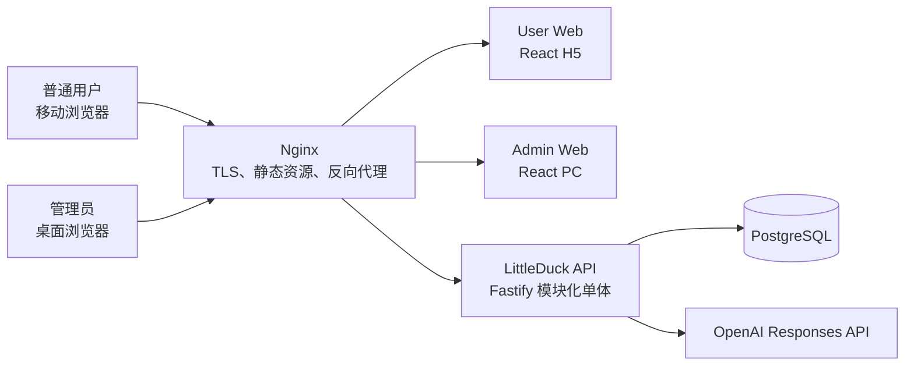
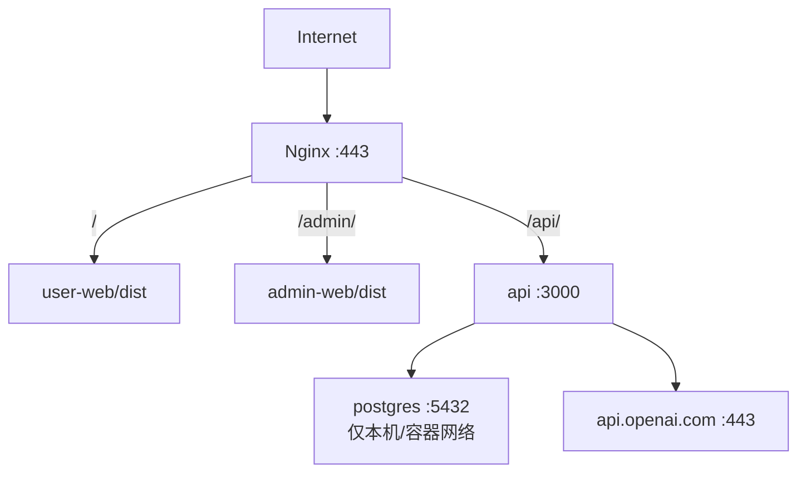
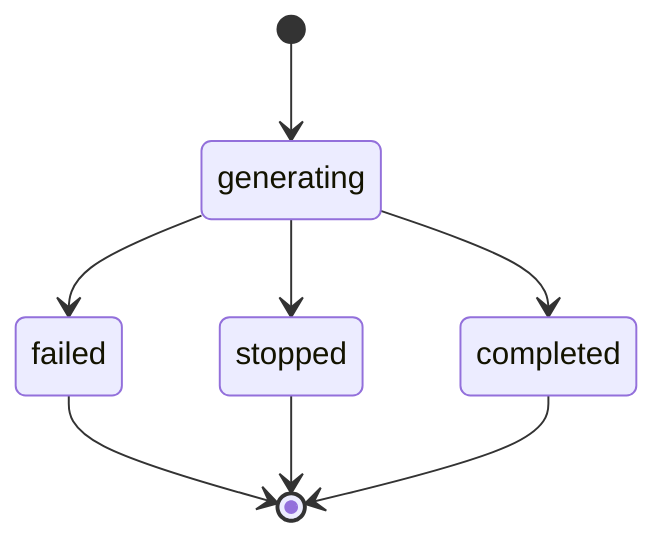
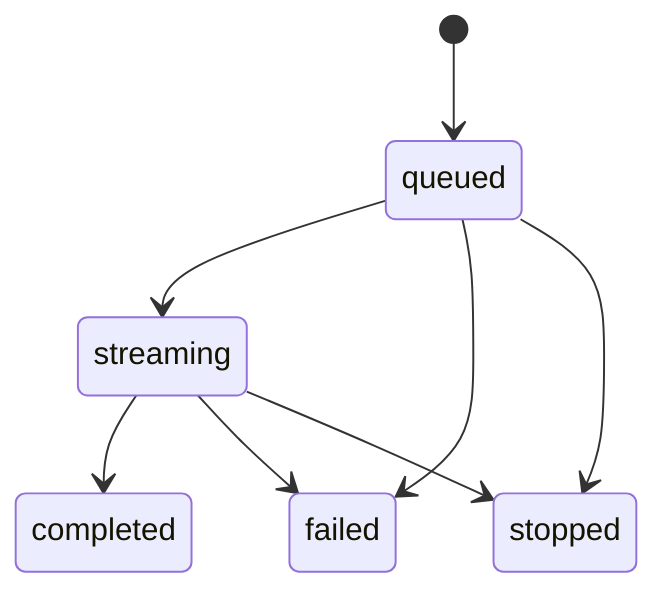

# LittleDuck MVP 技术架构基线

## 1. 结论

LittleDuck MVP 采用“两个独立 Web 前端 + 一个 TypeScript 模块化单体 API + PostgreSQL + Nginx”的单机部署架构。

- 用户端 H5 与 PC 管理端是两个独立构建产物，分别使用 `/` 与 `/admin/` 路径。
- 所有业务 API 位于同源 `/api/v1/`，避免生产环境跨域和第三方 Cookie 问题。
- 用户 API 与管理 API 分别位于 `/api/v1/user/` 和 `/api/v1/admin/`，使用不同 Cookie、不同会话表、不同中间件。
- API 服务内部按领域模块拆分，但 MVP 不拆微服务，不引入 Redis、消息队列或 Kubernetes。
- PostgreSQL 是用户、会话、消息、生成任务、LLM 调用、流事件、配置和后台任务的权威存储。
- OpenAI 只由服务端调用。前端永远不接触 OpenAI API Key，也不依赖 OpenAI 的原始事件格式。
- LittleDuck 对前端提供稳定的应用级 SSE 合同；服务端适配器把 OpenAI Responses API 的流式语义转换为该合同。

该方案优先保证：单台腾讯云服务器可部署、权限边界清晰、合同可测试、失败状态可恢复，以及后续可在不改变前端合同的前提下替换供应商适配实现。

## 2. 系统上下文



### 信任边界

1. 浏览器是不可信客户端；所有身份、资源归属、状态迁移和幂等性均由服务端校验。
2. 用户端和管理端是两个身份域。普通用户 Cookie 不能授权管理 API，管理员 Cookie 不能作为用户会话使用。
3. OpenAI 是外部供应商。供应商错误只在管理员调用详情中按实际内容记录；普通用户仅获得稳定、无敏感信息的应用错误。
4. Git、日志和前端构建产物中不得出现真实 API Key、会话 Token、加密主密钥或服务器凭据。

## 3. 技术选型

| 层 | 选择 | 说明 |
| --- | --- | --- |
| 运行时 | Node.js 24 LTS、TypeScript、pnpm workspace | 与当前验证环境一致；一个语言覆盖前后端与合同工具 |
| 用户端 | React + Vite | 适合 H5、流式 UI、Markdown 和移动端状态管理 |
| 管理端 | React + Vite | 独立入口和构建产物，不复用 H5 布局 |
| API | Fastify | 插件化模块边界、Schema 校验、低开销 SSE/HTTP 支持 |
| 数据库 | PostgreSQL 16+ | 事务、约束、JSONB、部分唯一索引和游标分页足以覆盖 MVP |
| 数据访问 | SQL migration + 类型安全 repository 层 | 数据约束以数据库为最终防线；具体 ORM 可由 WI-003 在不改变合同的前提下选择 |
| 外部 LLM | 服务端 OpenAI provider adapter | 管理员保存模型字符串；应用代码不锁定具体模型 ID |
| 流式协议 | HTTP POST 建立 SSE + GET 恢复 SSE | POST 支持创建/重试请求体；GET 使用事件序号恢复 |
| 生产入口 | Nginx | TLS、静态文件、`/api` 反向代理、禁用 SSE 缓冲 |
| 部署单元 | 一个 API 进程、一个 PostgreSQL、两个静态站点 | 适合单台腾讯云服务器；后续可水平拆分但不是 MVP 范围 |

OpenAI 适配器使用 Responses API 的文本生成与 `stream: true` 能力。官方文档说明 Responses API 可用于直接文本生成，并通过 SSE 产生类型化流事件。LittleDuck 不把这些供应商事件直接暴露给前端，而是转换成 `generation.*` 事件，避免供应商事件变化扩散到用户端和管理端。

## 4. 部署拓扑



Nginx 对 SSE 路径必须：

- 使用 HTTP/1.1；
- 关闭代理缓冲；
- 设置足够长的读取超时；
- 不压缩 `text/event-stream`；
- 透传 `Last-Event-ID`；
- 禁止缓存。

数据库不暴露公网端口。API Key 加密主密钥只通过生产 Secret/环境变量注入。

## 5. 代码与模块边界

```text
apps/
  api/
    src/
      modules/
        user-auth/
        admin-auth/
        conversations/
        generations/
        llm-config/
        admin-topics/
        llm-provider/
        jobs/
      plugins/
      app.ts
      server.ts
  user-web/
  admin-web/
packages/
  contracts/
  shared/
```

| 模块 | 职责 | 不负责 |
| --- | --- | --- |
| `user-auth` | 注册、登录、7 天用户会话、退出、CSRF | 管理员登录 |
| `admin-auth` | 管理员初始化、密码校验、管理员会话 | 普通用户身份 |
| `conversations` | 会话、消息、标题、搜索、分页、归属校验 | 调用供应商 |
| `generations` | 首次发送、继续对话、停止、重试、幂等、SSE、状态机 | 保存 LLM 配置 |
| `llm-config` | 单一生效配置、API Key 加解密、测试连接、即时生效 | 用户话题调用记录 |
| `admin-topics` | 全部话题、消息和 LLM 调用只读查询 | 修改或删除用户数据 |
| `llm-provider` | OpenAI Responses API 适配、错误归一化、取消信号 | HTTP 用户合同 |
| `jobs` | 标题生成、崩溃恢复、过期流事件清理 | 外部队列系统 |
| `contracts` | OpenAPI、生成类型、示例和合同检查 | 业务实现 |

模块之间只能通过明确的应用服务接口调用。路由不得直接跨模块访问其他模块的数据表。

## 6. 核心业务流程

### 6.1 注册和登录

1. 服务端先校验请求格式和验证码。
2. 注册：验证码不正确时不查询并暴露手机号状态；验证码正确后检查手机号是否已注册。
3. 登录：同时完成验证码和注册状态判断，但对外使用稳定错误码。
4. 成功后创建随机 256-bit 会话 Token，只把 Token 哈希保存到数据库。
5. 原始 Token 通过 `HttpOnly + Secure + SameSite=Lax` Cookie 返回。
6. 响应体返回当前会话的 CSRF Token；后续所有有副作用请求必须携带 `X-CSRF-Token`。
7. 同一用户允许存在多个有效会话，互不踢下线。

### 6.2 首条消息和新会话

首条消息采用一个数据库事务完成：

1. 校验文本、幂等键、用户会话和当前无冲突生成任务。
2. 创建会话。
3. 创建并保存用户消息。
4. 以首条消息前 20 个字符生成临时标题。
5. 创建空的助手消息、生成任务和 `in_progress` LLM 调用记录。
6. 提交事务后建立 SSE 并调用 OpenAI。

因此，供应商调用前的校验或数据库失败不会创建历史会话；用户消息一旦被确认保存，后续供应商失败会留下失败助手消息和真实 LLM 调用记录。

### 6.3 继续对话

- 服务端按 `conversation.user_id = current_user.id` 查询，不能先查询会话再在应用层“补做”权限判断。
- 上下文从当前会话中按时间正序选取最近的完整成功用户—助手轮次。
- 失败或停止的助手消息不作为成功上下文。
- 当前用户消息必须包含。
- 超过模型上下文预算时，从最早完整轮次开始移除。
- 聊天调用默认不添加不存在的 System Prompt。

### 6.4 重试

- 重试目标必须是当前用户会话中最新、可重试的失败或停止助手消息。
- 其后若已有新用户消息，则返回 `RETRY_NOT_ALLOWED`。
- 重试复用原用户消息，不插入第二条用户消息。
- 创建新的助手消息、生成任务和 LLM 调用记录。
- 原失败/停止助手消息保留，且不进入重试上下文。

### 6.5 停止和退出

- `stop` 请求设置持久化的 `cancel_requested_at`，并触发当前进程中的 `AbortController`。
- 停止接口是幂等的；对已完成任务返回当前最终状态。
- 用户退出时，只停止由当前用户会话发起的活动生成，不影响同一账号其他设备会话。
- 已收到的内容保存为助手消息和 LLM 调用的部分返回，最终状态为 `stopped`。

### 6.6 标题生成

聊天首个助手回复成功后，在同一事务中写入一个持久化 `title_generation` 后台任务，然后立即结束聊天 SSE：

- 标题生成不阻塞聊天完成；
- 输入固定为首条用户消息和本会话首个成功助手回复；
- 每次尝试都创建独立 `llm_calls` 记录；
- 成功后原子更新会话标题和 `title_status=final`；
- 失败时保留临时标题；后续符合条件的成功回复可再次排队，但仍使用原始两项输入。

MVP 使用 PostgreSQL 任务表与 API 进程内 worker，不引入独立消息队列。

## 7. 状态机

### 7.1 助手消息



每次重试创建新的助手消息，不修改原失败或停止消息。

### 7.2 生成任务



数据库使用部分唯一索引保证同一会话最多一个 `queued` 或 `streaming` 任务。

### 7.3 LLM 调用

`in_progress -> succeeded | failed | stopped`

每个调用在供应商请求发出前保存实际 Prompt、服务商和模型；流式过程中节流更新部分返回；终态保存实际完整或部分返回和实际错误。

## 8. 幂等、并发与排序

- 创建生成和重试必须携带 `Idempotency-Key`。
- 幂等范围是当前会话 Token；服务端保存键哈希和请求体指纹。
- 同一键、同一指纹返回原任务或继续其流；同一键、不同指纹返回 `IDEMPOTENCY_KEY_REUSED`。
- 用户消息另有 `(user_id, client_message_id)` 唯一约束，防止页面重试导致重复保存。
- 对话排序使用 `last_activity_at DESC, id DESC`。
- 消息和调用详情使用稳定游标，不使用可漂移的页码。
- 管理端话题列表按 `last_activity_at DESC, id DESC`，默认每页 20。

## 9. 故障与恢复

| 故障 | 行为 |
| --- | --- |
| 浏览器断线 | 不取消生成；服务端继续保存；客户端可用生成 ID 和事件序号恢复 |
| 页面关闭 | 不直接判失败；再次进入时查询权威消息/生成状态 |
| OpenAI 超时/限流/Key 无效 | 助手与调用标为失败；用户收到稳定提示；管理员可见真实供应商错误 |
| API 进程崩溃 | 启动恢复任务把遗留 `queued/streaming` 标为失败，保留部分内容 |
| stop 与 completed 竞争 | 数据库条件更新只允许一个终态获胜；返回最终权威状态 |
| 标题生成失败 | 不影响聊天；保留临时标题并记录调用 |
| LLM 配置不可用 | 历史查询继续可用；新的生成失败；保存新配置后后续调用即时使用 |

## 10. API 版本与变更规则

- 初始合同固定为 `/api/v1`。
- OpenAPI 中的路径、字段、必填性、状态码、错误码、Cookie、分页、幂等和 SSE 事件均属于合同语义。
- 前后端只能消费 Coordinator 接受的 WI-001 Artifact。
- 合同接受后，任何语义修改必须先向 Coordinator 发送 `work_item_proposed`，由独立合同修订 Work Item 生成完整合并合同。
- 供应商适配器内部变化若不改变 LittleDuck 合同，无需修改前端合同。

## 11. 明确不在骨架中实现

- 完整注册、聊天、管理端业务逻辑；
- 真实 OpenAI 调用；
- 生产数据库迁移执行；
- UI 视觉稿的完整实现；
- 腾讯云生产配置和实际部署；
- 内容安全、计费、多模型、多模态、RAG、工具调用或用户管理。

工程骨架只证明目录边界、构建链路、健康检查、合同校验和 Mock 可启动。
