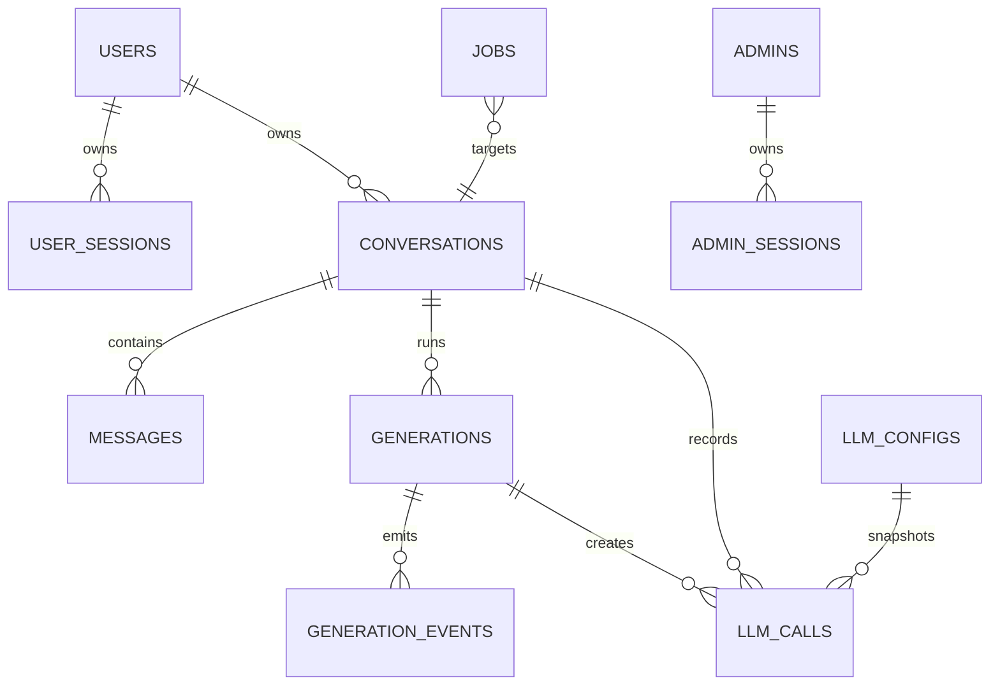

# 数据模型与一致性设计

## 1. 设计原则

- PostgreSQL 是业务状态唯一权威来源。
- 所有时间以 UTC 存储、ISO 8601 传输；Asia/Shanghai 只用于列表分组和管理端日期筛选边界。
- ID 使用 UUID。
- 手机号规范化为中国大陆 11 位数字，不保存 `+86` 前缀。
- 会话、消息和 LLM 调用长期保留；流事件是传输恢复材料，不替代最终消息和调用记录。
- 不用软删除模拟 PRD 未提供的删除功能。

## 2. 实体关系



## 3. 核心表

### `users`

| 字段 | 约束 |
| --- | --- |
| `id` | UUID PK |
| `phone` | 11 位数字，唯一 |
| `created_at` | UTC |

不保存验证码。`000000` 是应用规则，不是用户数据。

### `user_sessions`

| 字段 | 约束 |
| --- | --- |
| `id` | UUID PK |
| `user_id` | FK users |
| `token_hash` | SHA-256，唯一 |
| `csrf_token_hash` | SHA-256 |
| `expires_at` | 登录后 7 天 |
| `revoked_at` | nullable |
| `created_at` / `last_seen_at` | UTC |

同一用户可有多个有效会话。退出只撤销当前 Session。

### `admins` / `admin_sessions`

- 初始化唯一管理员 `admin`。
- 密码使用 Argon2id 哈希，绝不保存明文 `admin`。
- 管理员 Session 与用户 Session 完全分表。
- 管理员 Session 建议 12 小时绝对有效期；该值通过非敏感配置调整。

### `conversations`

| 字段 | 说明 |
| --- | --- |
| `user_id` | 所有用户查询必须带此条件 |
| `title` | 最多 20 个 Unicode 字符 |
| `title_status` | `temporary` / `final` |
| `first_user_message_id` | 固定标题输入 |
| `first_successful_assistant_message_id` | 首个成功助手回复 |
| `last_activity_at` | 用户、完成、失败或停止助手消息都会更新 |
| `created_at` / `updated_at` | UTC |

“话题”不另建表；管理端话题就是会话投影。

### `messages`

| 字段 | 说明 |
| --- | --- |
| `role` | `user` / `assistant` |
| `status` | 用户为 `persisted`；助手为 `generating/completed/failed/stopped` |
| `content` | 用户文本、助手完整或部分文本 |
| `client_message_id` | 用户提供，用户范围唯一 |
| `reply_to_message_id` | 助手对应的用户消息 |
| `retry_of_message_id` | 重试助手指向原失败/停止助手 |
| `generation_id` | 关联生成 |
| `created_at` / `updated_at` | UTC |

失败和停止助手消息永久保留。重试永远新增助手消息。

### `generations`

| 字段 | 说明 |
| --- | --- |
| `kind` | `chat` / `retry` |
| `status` | `queued/streaming/completed/failed/stopped` |
| `conversation_id` | 所属会话 |
| `user_message_id` | 当前或复用的用户消息 |
| `assistant_message_id` | 本次新助手消息 |
| `origin_user_session_id` | 用于退出时只停止当前设备生成 |
| `idempotency_key_hash` | 不保存明文键 |
| `request_fingerprint` | 规范化请求体 SHA-256 |
| `last_event_sequence` | SSE 持久事件序号 |
| `cancel_requested_at` | stop 或退出请求 |
| `started_at` / `finished_at` | UTC |

部分唯一索引保证同一会话最多一个活动生成。

### `generation_events`

- 主键 `(generation_id, sequence)`；
- 保存 `generation.started/delta/completed/failed/stopped` 的最小可重放载荷；
- delta 由服务端按时间或大小合并后写入，避免每个 token 一次事务；
- 事件至少保留 24 小时；过期后客户端改用生成状态与消息详情；
- `heartbeat` 不持久化，也没有事件序号。

### `llm_configs`

MVP 只有 `id = 1`：

- `provider = openai`；
- `model` 明文；
- `api_key_ciphertext`、`api_key_iv`、`api_key_tag`；
- `updated_by_admin_id`、`updated_at`。

API Key 使用 `CONFIG_ENCRYPTION_KEY` 派生的 AES-256-GCM 密钥加密。管理端读取时由服务端解密并只返回给已认证管理员。

### `llm_calls`

| 字段 | 说明 |
| --- | --- |
| `call_type` | `chat/title/retry` |
| `provider` / `model` | 调用时快照 |
| `prompt_json` | 实际角色和顺序；不补不存在内容 |
| `response_text` | 实际完整或部分返回 |
| `status` | `in_progress/succeeded/failed/stopped` |
| `provider_response_id` | nullable |
| `provider_error_code/message` | 管理员可见，绝不含 API Key |
| `started_at` / `finished_at` | UTC |

配置测试不写 `llm_calls`，因为它不属于用户话题。

### `jobs`

用于标题生成和恢复任务：

- `job_type=title_generation`；
- `status=pending/running/succeeded/failed`；
- `dedupe_key` 唯一；
- `payload_json` 只保存对象 ID，不复制消息全文；
- `available_at`、`attempts`、`locked_at`。

## 4. 关键事务

### 新会话生成事务

`conversation + user message + assistant placeholder + generation + llm_call`

任一失败则整体回滚。因此发送失败时不创建历史会话。

### 终态事务

`generation terminal + assistant terminal + llm_call terminal + final event + conversation.last_activity_at`

使用条件更新 `WHERE generation.status IN ('queued','streaming')` 保证 completed/failed/stopped 只能有一个结果。

### 标题任务事务

首个助手成功后：

1. 若 `first_successful_assistant_message_id` 为空则设置；
2. 若标题仍为 temporary，插入带去重键的 title job；
3. 聊天生成终态提交，不等待 job 执行。

## 5. 权限查询模板

用户资源禁止以下模式：

```sql
SELECT * FROM conversations WHERE id = $1;
-- 然后在应用层比较 user_id
```

必须使用：

```sql
SELECT *
FROM conversations
WHERE id = $1 AND user_id = $2;
```

消息、生成和恢复流均通过 conversation owner 连接条件查询。越权和不存在统一返回 404，避免枚举。

管理员查询使用独立认证中间件，可以读取所有会话，但所有端点只读。

## 6. 分页

- 游标使用 base64url 编码的版本化 JSON，并由服务端 HMAC 签名。
- 会话游标包含 `lastActivityAt` 与 `id`。
- 消息游标包含 `createdAt` 与 `id`；`before` 返回更早数据，响应保持正序便于前端插入顶部。
- 管理话题使用 cursor + limit，默认 20。
- 管理日期筛选把 Asia/Shanghai 所选日期转换为 UTC 半开区间。

详细 PostgreSQL 约束见 `schema.sql`。
