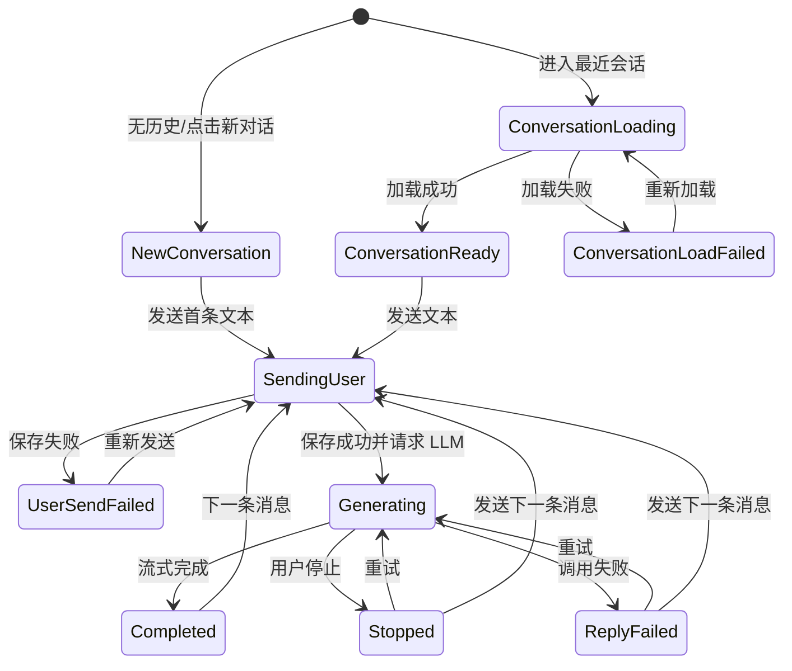

# LittleDuck MVP UX/UI 完整规格

版本：WI-002 revision 1  
依据：`LittleDuck_Chatbot_MVP_PRD.md` V1.7、`/页面UI稿` 五张用户端基准稿  
适用范围：用户端 H5（375–430 CSS px）与 PC Web 管理端（1280 CSS px 及以上）

## 1. 设计结论与边界

### 1.1 延续的核心视觉方向

- 保留现有稿的鸭子 Logo、绿色品牌主色、大面积白色/浅灰背景、高圆角、轻边框、高留白和黑灰文字。
- 用户端继续使用右侧绿色用户气泡、左侧头像 + 白色助手气泡。
- 登录/注册页继续使用居中品牌区、大尺寸输入框、绿色主按钮。
- 新增的加载、错误、停止和重试状态使用克制的内联反馈，不引入大面积弹窗或新的视觉体系。
- 管理端沿用同一品牌色和圆角语言，但改用适合桌面信息密度的左侧导航、表格、页签、详情卡片。

### 1.2 必须修正的基准稿内容

- `对话框.png` 中输入区左侧“+”以及 `对话框-输入状态.png` 中图片图标必须隐藏。
- 用户端不得出现图片、文件、语音、多模型选择、复制成功回复、点赞、点踩、重新生成成功回复等入口。
- 历史侧边栏不得增加删除、重命名、置顶或批量管理入口。
- 管理端不得增加用户管理、用量看板、Prompt 编辑、重发用户对话、配置版本或审计功能。

## 2. 视觉与组件 Token

以下值作为开发起点；与品牌 Logo 原始素材存在 1–2 个 RGB 色值差异时，以 Logo 素材为准。

| Token | 建议值 | 用途 |
| --- | --- | --- |
| `--brand-600` | `#36AB84` | 主按钮、发送、选中、链接 |
| `--brand-700` | `#268B6B` | 按压/悬停 |
| `--brand-100` | `#E8F5F0` | 当前会话、轻提示背景 |
| `--page-bg` | `#F8F8FA` | 聊天页、管理端内容背景 |
| `--surface` | `#FFFFFF` | 卡片、气泡、导航 |
| `--text-1` | `#1F2329` | 标题、正文 |
| `--text-2` | `#5F6670` | 次要信息 |
| `--text-3` | `#9298A1` | 占位、禁用 |
| `--border` | `#E1E3E6` | 输入框、卡片边框 |
| `--danger-600` | `#D64545` | 错误、失败 |
| `--danger-100` | `#FFF0F0` | 错误提示背景 |
| `--warning-600` | `#B76E00` | 已停止、警告 |
| `--warning-100` | `#FFF6E5` | 警告背景 |
| `--success-600` | `#1F8F65` | 成功状态 |
| `--success-100` | `#EAF7F1` | 成功提示背景 |
| `--overlay` | `rgba(31,35,41,.42)` | 抽屉遮罩 |

圆角与阴影：

- H5 输入框/按钮：16–22 px；消息气泡：18 px；状态小胶囊：999 px。
- 管理端输入框/按钮：8 px；卡片：12 px；表格容器：12 px。
- H5 只在底部输入区和抽屉使用极轻阴影；管理端卡片优先使用边框而非重阴影。
- 聚焦态统一使用 `0 0 0 3px rgba(54,171,132,.18)`，不得仅依靠颜色表达状态。

文字：

- 中文优先系统字体：`-apple-system, BlinkMacSystemFont, "PingFang SC", "Microsoft YaHei", sans-serif`。
- H5 正文 16 px / 1.6；辅助文字 13–14 px；页面标题 20–24 px。
- 管理端正文 14 px / 1.6；页面标题 24 px；表格表头 13 px、字重 600。
- 代码使用 `SFMono-Regular, Consolas, "Liberation Mono", monospace`。

通用组件：

- 所有可点击控件的有效点击区域不小于 44 × 44 CSS px。
- 加载按钮保留原宽高，左侧 16 px 环形进度，不因文案变化造成布局跳动。
- Toast 位于安全区内；H5 距可视顶部 72 px，PC 位于右上 24 px。
- Toast 默认 3 秒消失；关键失败同时在对应内容区域保留可恢复入口，不能只依赖 Toast。
- Skeleton 采用浅灰块 1.2 秒渐变，不展示伪造内容。

## 3. 用户端 H5 布局规格

### 3.1 视口与基础布局

| 项目 | 规格 |
| --- | --- |
| 重点宽度 | 375、390、393、414、430 CSS px |
| 页面宽度 | `width: 100%`，禁止横向滚动 |
| 页面高度 | 优先 `100dvh`，回退 `100vh` |
| 左右页边距 | 20 px；430 px 时可增至 24 px |
| 顶部安全区 | `env(safe-area-inset-top)` |
| 底部安全区 | `env(safe-area-inset-bottom)` |
| 最大内容宽 | 430 px；更宽移动视口居中，不拉伸气泡至平板宽度 |
| 横屏 | 仍维持单列；压缩品牌区纵向留白，聊天页优先保证消息区与输入区 |

禁止使用固定 1936 设计稿高度还原页面。内容必须按真实动态视口布局。

### 3.2 顶部导航

- 高度：56 px + 顶部安全区。
- `position: sticky; top: 0`，层级高于消息区、低于抽屉。
- 左侧 Logo 36 × 36 px；中间标题 `LittleDuck`；右侧历史入口 44 × 44 px。
- 标题过长场景不适用；聊天页不在顶部显示会话标题。
- 页面加载时顶部导航保持可见，避免白屏。

### 3.3 聊天消息区

- 使用独立滚动容器，占据顶部导航与底部输入区之间的剩余空间。
- 左右内边距 16 px，顶部/底部内边距 20 px。
- 用户气泡最大宽度 82%，助手内容区最大宽度为可用宽度减头像与 12 px 间距。
- 同一消息 Markdown 内部不得再套额外气泡。
- URL、长单词使用 `overflow-wrap:anywhere`；代码块横向滚动，不撑破页面。
- 消息间距 16 px，同一角色连续消息可缩至 10 px。
- 状态、时间和重试按钮放在所属消息下方，不能漂浮到其他消息。

### 3.4 底部输入区

- 正常态高度：68 px + 底部安全区；多行时随输入框增长，最大约 156 px + 安全区。
- 输入区固定在动态视口底部，不使用会被 iOS 键盘遮挡的纯 `position: fixed` 方案；推荐页面根容器 `display:grid; grid-template-rows:auto 1fr auto`。
- 输入框最少 44 px、最多 5 行；超过后内部滚动。
- 仅保留文本输入和右侧发送/停止按钮；不得保留图片、附件或“+”。
- 发送按钮 44 × 44 px；可发送时绿色，禁用时灰色。
- 生成中按钮切换为停止图标，`aria-label="停止生成"`；输入框保留草稿但不可提交。
- 超过 4,000 字符后输入框下方显示红色 `已超出 N 个字符`，发送禁用。
- 3,800–4,000 字符显示中性计数 `剩余 N 字`，帮助用户预判限制。

### 3.5 软键盘

- 聚焦输入框后，输入区始终紧贴 `visualViewport` 底部，消息区同步缩短。
- 键盘出现时不把整页向上平移，不允许顶部导航消失到视口外。
- 键盘弹出前若用户位于消息底部，弹出后继续保持底部；若用户在看历史，不强制跳底。
- iOS Safari 使用 `visualViewport.resize/scroll` 或等效框架能力更新可视高度；Android Chrome 使用 `dvh` 并监听 viewport 变化。
- 键盘收起后恢复原滚动位置，输入草稿不丢失。
- 横屏键盘下若消息区可视高度不足 160 px，仍保持导航和输入区可操作，消息区允许最小化。

## 4. 注册与登录状态规格

### 4.1 共用表单规则

- 手机号键盘：`inputmode="numeric"`，最多 11 位；国家码 `+86` 固定不可编辑。
- 验证码键盘：`inputmode="numeric"`，最多 6 位。
- 手机号合法后“获取验证码”可点击；点击后变为“验证码已获取”，不倒计时、不发短信。
- 未点击“获取验证码”也允许提交 `000000`。
- 提交前置条件：手机号格式合法且验证码为 6 位；业务端再判断验证码值与账号状态。
- 用户可见错误不得包含完整手机号、验证码、接口或内部异常详情。
- 提交中锁定本页提交和验证码按钮，防重复提交；保留输入值。
- 输入任一相关字段后，清除对应的旧业务错误，但不清除另一个字段的错误。
- 用户登录态成功建立后默认保持 7 天；有效期内再次进入 H5 直接恢复最近会话或新对话空态。

### 4.2 注册页状态

| 状态 | 触发 | 视觉与文案 | 控件 |
| --- | --- | --- | --- |
| 默认 | 初次进入 | 与基准稿一致；按钮禁用 | 输入可用 |
| 可提交 | 手机号合法 + 验证码 6 位 | 主按钮绿色 | 注册可用 |
| 手机号格式错误 | 失焦或提交 | 手机号框红边；`请输入正确的11位手机号` | 保留输入 |
| 验证码已获取 | 点击获取 | 按钮文案 `验证码已获取`，浅绿底 | 不倒计时；可再次聚焦输入 |
| 验证码错误 | 服务返回验证码不匹配 | 验证码框红边；`验证码错误，请重新输入` | 自动聚焦验证码；不清空手机号 |
| 提交中 | 点击注册 | 按钮 `注册中…` + spinner；全表单锁定 | 禁止重复提交 |
| 手机号已注册 | 验证码正确且账号存在 | 表单下内联错误：`该手机号已注册，请直接登录`；`去登录`为链接 | 保留手机号 |
| 网络错误 | 请求未完成 | 顶部轻错误条：`网络连接失败，请检查网络后重试` | 主按钮恢复为可用 |
| 注册成功 | 成功响应 | 按钮短暂 `注册成功`；立即进入聊天页 | 不额外弹窗 |

### 4.3 登录页状态

| 状态 | 触发 | 视觉与文案 | 控件 |
| --- | --- | --- | --- |
| 默认/可提交 | 同注册页 | 与登录基准稿一致 | 同注册页 |
| 手机号格式错误 | 失焦或提交 | `请输入正确的11位手机号` | 保留输入 |
| 验证码已获取 | 点击获取 | `验证码已获取` | 不倒计时 |
| 验证码错误 | 验证码不为 `000000` | `验证码错误，请重新输入` | 聚焦验证码 |
| 手机号未注册 | 验证码正确但账号不存在 | `该手机号尚未注册，请先注册` + `去注册` | 不静默注册 |
| 登录中 | 点击登录 | `登录中…` + spinner | 全表单锁定 |
| 网络错误 | 请求未完成 | `网络连接失败，请检查网络后重试` | 主按钮恢复 |
| 登录态失效 | 从受保护页跳转 | 页面顶部信息条 `登录已失效，请重新登录` | 正常登录 |
| 登录成功 | 成功响应 | 短暂成功态后进入最近会话/新对话 | 不额外弹窗 |

校验反馈顺序：本地手机号格式 → 验证码长度 → 服务端验证码结果 → 账号注册状态 → 网络/系统错误。一次只聚焦首个可修复问题。

## 5. 聊天页完整状态

### 5.1 页面级状态

| 状态 | 可观察结果 | 允许操作 |
| --- | --- | --- |
| 启动加载 | 导航和输入区骨架；消息区 3 条 skeleton | 历史入口禁用 |
| 新对话空态 | 静态欢迎语 `你好！有什么可以帮助你？`；不创建会话 | 输入并发送 |
| 会话加载 | 导航保持；消息 skeleton；输入暂时禁用 | 可返回/开抽屉 |
| 会话加载失败 | 居中 `对话加载失败` + `重新加载` | 可开抽屉切换其他会话 |
| 正常会话 | 展示已保存消息，定位最新消息 | 输入、开抽屉 |
| 断网 | 顶部细条 `网络已断开`；已保存内容仍展示 | 浏览、编辑草稿；发送触发失败 |
| 登录失效 | Toast `登录已失效，请重新登录` 后跳登录 | 无 |

### 5.2 消息发送与回复状态

| 状态 | 消息呈现 | 输入区 | 状态退出条件 |
| --- | --- | --- | --- |
| 草稿 | 输入框文本，未产生消息 | 可发送 | 点击发送/清空 |
| 用户消息待确认 | 右侧气泡立即出现；下方小 spinner | 发送锁定，避免重复 | 保存成功/失败 |
| 用户发送成功 | spinner 移除；首条成功时创建会话与临时标题 | 进入助手等待 | LLM 请求开始 |
| 用户发送失败 | 原气泡降低不透明度；红色 `发送失败` + `重新发送` | 可继续编辑新草稿 | 重发/刷新/切换 |
| 助手等待首段 | 左侧头像 + 三点生成指示 | 按钮为停止；不可提交 | 首个流片段/失败/停止 |
| 流式生成 | 助手白色气泡逐步增长；底部 `正在生成` | 按钮为停止；草稿可保留 | 成功/失败/停止 |
| 生成成功 | 移除生成标记；Markdown 完整渲染 | 可提交下一条 | 下一次发送 |
| 已停止 | 保留部分内容；橙色 `已停止`；符合条件时显示 `重试` | 恢复发送 | 重试/发送新消息 |
| 回复失败 | 错误卡 `回复生成失败，请稍后重试`；符合条件显示 `重试` | 恢复发送 | 重试/发送新消息 |
| 服务暂不可用 | 错误卡 `服务暂时不可用，请稍后再试` | 恢复发送 | 重试/配置恢复 |
| 重试中 | 原失败/停止记录保留；其后新增三点助手占位 | 按钮为停止 | 成功/失败/停止 |

规则：

- 同一页面同时只允许一个助手生成状态。
- 用户消息的幂等提交期间，快速重复点击只产生一个本地气泡和一个保存请求。
- 首条用户消息保存失败时不创建会话、不进入历史列表。
- 失败/停止的助手记录保留；重试生成的新助手记录追加在后方，不覆盖旧记录。
- 仅“其后尚无新用户消息”的最新失败或停止回复展示重试。
- 用户发送后续新消息后，旧重试按钮隐藏，但状态标签仍保留。
- 普通用户只看到归一化错误；API Key、额度、模型原始错误只在管理端调用详情展示。
- 页面被关闭或网络中断时不擅自标记失败；再次进入以服务端最终状态为准。

### 5.3 Markdown 与代码

- 支持段落、标题、列表、加粗、引用、链接、行内代码、代码块。
- H5 代码块顶部可显示语言标签，但不增加复制按钮；代码块内部横向滚动。
- 外链使用新窗口打开并带安全属性；长 URL 自动换行。
- 流式阶段允许增量渲染，但未闭合 Markdown 不应导致页面整体跳动或丢失正文。
- 成功回复不展示复制、赞踩、重新生成。

### 5.4 滚动与分页

- 首次进入历史会话加载最近 30 条并定位最底部。
- 顶部触发更早消息加载时，在顶部插入 32 px spinner，加载完成后保持首个旧消息的视觉位置，不跳动。
- 位于底部（距底小于 72 px）时，流式生成自动跟随。
- 用户主动上滚超过 72 px 后停止跟随，右下显示 44 px `回到底部` 浮动按钮。
- 新流内容到达时按钮可显示一个绿色圆点，不强制滚动。
- 点击按钮平滑到最新消息；减少动态效果设置开启时改为瞬时定位。
- 切换会话必须清空上一个会话的流式临时状态、未发送失败消息和滚动锚点。

## 6. 历史侧边栏

### 6.1 尺寸、层级与手势

- 抽屉宽度：视口的 80%，最小 300 px，最大 352 px；375 px 上为 300 px，430 px 上为 344 px。
- 从左侧进入，200 ms ease-out；遮罩覆盖剩余页面。
- 抽屉 `z-index: 1000`，遮罩 `999`；打开后锁定底层滚动与点击。
- 关闭方式：关闭按钮、遮罩、系统返回；不要求侧滑关闭，避免与浏览器返回冲突。
- 打开时焦点进入抽屉，关闭后回到历史入口。
- 底部退出固定在安全区之上；中间列表独立滚动。

### 6.2 状态

| 状态 | 表现 |
| --- | --- |
| 首次加载 | 标题、新对话、搜索可见；列表 skeleton |
| 无历史会话 | 插图/图标 + `还没有历史对话`；保留新对话按钮 |
| 默认列表 | 今天、昨天、最近7天、更早；最近活动倒序 |
| 当前会话 | 浅绿背景、左侧 3 px 绿色标识、`aria-current` |
| 搜索中 | 搜索框右侧 spinner；保留旧结果直至新结果返回 |
| 搜索结果 | 不显示时间分组，按最近活动倒序 |
| 搜索无结果 | `未找到相关对话`；提供 `清空搜索` |
| 增量加载 | 列表底部 spinner，不遮挡已有项目 |
| 增量失败 | 保留已有内容；底部 `加载失败，点击重试` |
| 生成锁定 | 会话项和新对话可浏览但不可切换；点击提示 `请等待回复完成或先停止生成` |

### 6.3 列表与搜索规则

- 项目高至少 52 px；标题一行省略；完整标题写入无障碍名称。
- 新会话首条用户消息保存成功后，以临时标题插入顶部。
- 失败、停止助手消息计入最近活动时间和分组。
- 搜索输入 300 ms 防抖；去除首尾空格；空字符串立即恢复分组列表。
- 列表分批加载；搜索结果与默认列表分别维护分页和加载状态。
- 点击已选中的当前会话只关闭抽屉，不重复请求。
- 点击“新对话”只进入未保存空态；当前已在空态时仅关闭抽屉。
- 点击“退出登录”不二次确认；若正在生成，退出登录视为停止生成并保留已生成部分，随后清除登录态、跳转登录页，浏览器返回不得恢复聊天数据。

## 7. H5 状态迁移

## 8. PC 管理端全局规格

### 8.1 框架

| 区域 | 1280 px 规格 | 1440 px 及以上 |
| --- | --- | --- |
| 左侧导航 | 224 px 固定 | 240 px 固定 |
| 内容区 | 剩余宽度，左右 32 px | 最大内容宽 1440 px，左右 40 px |
| 顶部页头 | 72 px | 72 px |
| 页面背景 | `#F8F8FA` | 同左 |
| 最小页面宽 | 1180 px；低于后出现页面级横向滚动 | 不做移动布局 |

左侧导航：

- 品牌区、`LLM 配置`、`聊天记录`，底部 `退出登录`。
- 当前菜单浅绿背景 + 绿色文字。
- 不增加用户、看板或系统设置菜单。
- 管理员会话失效时直接返回独立登录页。

### 8.2 PC 通用状态

- 页面加载：页头保留、主内容 skeleton。
- 空态：卡片内居中，说明原因并给范围内操作。
- 查询失败：保留筛选值；内容区显示错误与重试。
- Toast 用于保存/复制等瞬时反馈；核心失败必须在组件内保留。
- 表格首列/操作列无须固定；页面宽度不足时表格容器横向滚动。
- 所有时间使用 `YYYY-MM-DD HH:mm:ss`，Asia/Shanghai。

## 9. 管理员登录

布局：

- 全屏浅灰背景，中间 420 × 自适应高度白色卡片。
- 品牌 Logo 64 px、标题 `LittleDuck 管理端`、副标题 `管理员登录`。
- 账号、密码输入框和全宽主按钮。
- 不提供注册、找回密码、修改密码入口。

| 状态 | 表现 |
| --- | --- |
| 默认 | 空表单；账号可自动聚焦 |
| 可提交 | 两字段非空，按钮绿色 |
| 登录中 | `登录中…` + spinner；表单锁定 |
| 账号或密码错误 | 卡片内错误条 `账号或密码错误`，不区分原因 |
| 网络错误 | `网络连接失败，请稍后重试` |
| 登录成功 | 进入 LLM 配置页；不保留登录卡片 |

按 Enter 在非空时提交；重复提交只产生一个请求。

## 10. LLM 配置页

### 10.1 页面结构

- 页标题 `LLM 配置`；说明 `配置将用于后续聊天回复、会话标题生成和重试`。
- 主表单卡片建议 760 px 宽。
- 服务商：只读输入 `OpenAI`。
- API Key：多行或单行可横向滚动的明文输入；不提供显示/隐藏切换，避免暗示默认脱敏。
- 模型：普通文本输入。
- 操作区：次按钮 `测试连接`、主按钮 `保存`；旁边显示 `测试可能产生少量模型费用`。
- 页面不展示温度、最大输出长度或 System Prompt。

### 10.2 状态

| 状态 | 视觉 | 交互 |
| --- | --- | --- |
| 首次未配置 | 空表单 + 信息条 `尚未配置，请填写 API Key 和模型` | 保存需必填 |
| 已加载 | 展示完整明文 API Key 与模型 | 可编辑 |
| 编辑中 | 页头显示 `有未保存的修改` | 测试使用当前值 |
| 测试中 | 测试按钮 spinner；保存仍可用 | 禁止重复测试 |
| 测试成功 | 表单下绿色结果 `连接成功` | 不自动保存 |
| 测试失败 | 红色结果区展示服务商返回错误；明确 `仍可保存当前配置` | 保存仍可用 |
| 保存中 | 保存按钮 spinner；表单暂锁 | 测试禁用 |
| 保存成功 | Toast `配置已保存并立即生效`；清除脏状态 | 后续调用用新配置 |
| 保存失败 | 表单上方错误条 `保存失败，请重试` | 保留所有输入 |

必填为空时在对应字段下显示 `请输入 API Key` / `请输入模型`，不发起保存。非空但不可用仍允许保存。

## 11. 话题列表

### 11.1 查询区

- 第一行：话题标题关键词、完整手机号、日期类型（创建日期/最近消息日期）、起止日期、`查询`、`重置`。
- 手机号为精确查询；标题为包含匹配。
- 日期选择明确包含开始日和结束日。
- 查询操作重置到第 1 页；默认每页 20 条。

### 11.2 表格

列顺序：

1. 话题标题（可点击，最大 320 px，两行省略）；
2. 用户手机号（完整）；
3. 消息数量；
4. LLM 调用次数；
5. 创建时间；
6. 最近消息时间。

默认按最近消息时间倒序。表格只读，不提供编辑、删除、更多菜单。

### 11.3 状态

| 状态 | 表现 |
| --- | --- |
| 加载中 | 表头保留，8 行 skeleton |
| 有数据 | 表格 + 总数 + 分页 |
| 全局无话题 | `暂无话题`，不显示重置筛选 |
| 筛选无结果 | `未找到符合条件的话题` + `重置筛选` |
| 加载失败 | 表格区错误 `话题加载失败` + `重新加载`；筛选值保留 |
| 翻页中 | 当前表格降低透明度并显示局部 loading，避免整页跳动 |

## 12. 话题详情：聊天记录

### 12.1 详情页头

- 返回 `聊天记录`。
- 话题标题。
- 元信息：完整手机号、创建时间、最近消息时间。
- 页签：`聊天记录`、`LLM 调用详情`，并可显示各自数量。

### 12.2 消息列表

- 正序展示全部消息。
- 用户消息：右对齐浅绿色卡片；助手消息：左对齐白色卡片。
- 每条显示角色、时间、状态。
- 状态徽标：成功、发送失败、进行中、失败、已停止。
- 重试产生的多个助手记录分别排列；不得覆盖。
- 管理端允许对消息正文复制；复制按钮只在 hover/focus 显示，键盘仍可访问。

长文本与代码：

- 普通正文默认最大高度 240 px，超出显示渐变遮罩 + `展开全部`。
- 代码块默认最大高度 320 px，内部双向滚动；提供 `复制代码`。
- 展开后提供 `收起`；展开状态仅为本地视图状态。

状态：加载 skeleton、无聊天记录、加载失败、有数据。无记录仍保留话题元信息和页签。

## 13. 话题详情：LLM 调用详情

### 13.1 列表与卡片

- 按调用时间正序。
- 左侧步骤轴或序号，右侧调用卡片。
- 卡片摘要行：`步骤 N`、调用类型、状态、调用时间、OpenAI / 模型。
- 调用类型固定呈现：聊天回复、会话标题生成、重试。
- 状态：进行中（蓝/中性 spinner）、成功（绿）、失败（红）、已停止（橙）。
- `关联内容`显示实际关联的消息摘要或话题；不创造不存在的数据。

### 13.2 Prompt 与返回内容

- 卡片内两个独立区块：`Prompt`、`LLM 返回内容`。
- Prompt 按实际角色顺序展示，每段头部显示 role；不存在 System Prompt 时不得补一个空段。
- 不展示请求头、网络信息或模型参数原始请求体。
- 返回内容按实际聚合；失败/停止可为空或部分内容。
- 失败时增加 `错误信息`区，允许展示服务商原始错误。
- 每个区块默认最大高度 360 px，支持展开/收起、内部滚动、复制。
- `复制`复制完整原文而非当前折叠片段，成功 Toast `已复制`。
- 进行中记录可轮询更新；完成后状态与聚合内容原位更新，不重排步骤。

状态：加载、无调用记录、加载失败、有数据。测试连接不进入此页。

## 14. 管理端响应式与可访问性

- 设计验收基准：1280 × 800、1440 × 900、1920 × 1080。
- 1280 px 时筛选项允许换为两行，但表格列不隐藏。
- 低于 1180 px 不做 H5 重排；显示横向滚动以保留信息完整性。
- 长文本区域必须有键盘可达的展开与复制按钮。
- 状态不能只靠红/绿区分，必须同时包含图标或文字。
- Tab 顺序与视觉顺序一致；可见焦点；页签使用正确 ARIA 语义。
- Logo 图片提供替代文本；纯装饰图标标记隐藏。
- 错误提示与输入框通过 `aria-describedby` 关联。

## 15. 前端实现检查点

- H5 没有图片、附件、“+”、语音或模型入口。
- `100dvh`、安全区、视觉视口和消息滚动容器组合在 iOS/Android 均验证。
- 生成中可开抽屉和搜索，但会话项与新对话处于不可切换状态。
- 发送、重试、停止均具备幂等/防重 UI。
- 页面级失败不清空已成功展示的数据；分页失败保留已加载数据。
- 所有新状态均有明确恢复动作或自动退出条件。
- 管理端测试失败不禁用保存；保存成功说明立即生效。
- 管理端 Prompt 按真实角色顺序展示，不伪造 System Prompt。
- 管理端长文本、代码块均支持展开、滚动和复制。

## 16. QA 验收映射

| 验收主题 | 关键可观察结果 |
| --- | --- |
| 注册/登录 | 未获取验证码也能用 `000000`；错误状态不泄露手机号/验证码 |
| 新会话 | 首条发送失败不创建会话；成功后临时标题立即进入顶部 |
| 生成 | 发送按钮变停止；输入草稿保留但不可提交 |
| 停止/失败 | 部分内容和原失败记录保留；符合条件才显示重试 |
| 重试 | 不重复用户消息；新助手回复追加；旧失败内容不参与上下文 |
| 滚动 | 底部自动跟随；用户上滚后停止并出现回到底部 |
| 抽屉 | 80% 左抽屉、遮罩锁底层；生成时可查看搜索但不可切换 |
| 软键盘 | 输入区始终在键盘上方；收起后滚动位置和草稿保留 |
| 管理登录 | `admin/admin` 可登录；错误不区分账号或密码 |
| 配置 | 测试用当前未保存值；测试失败仍可保存；保存失败保留输入 |
| 话题列表 | 标题/手机号/日期筛选、20 条分页、三种空失败状态 |
| 聊天详情 | 消息正序、失败/停止/重试记录不覆盖、长文本可展开复制 |
| 调用详情 | 真实 Prompt 角色顺序、部分返回/错误、折叠滚动复制 |
